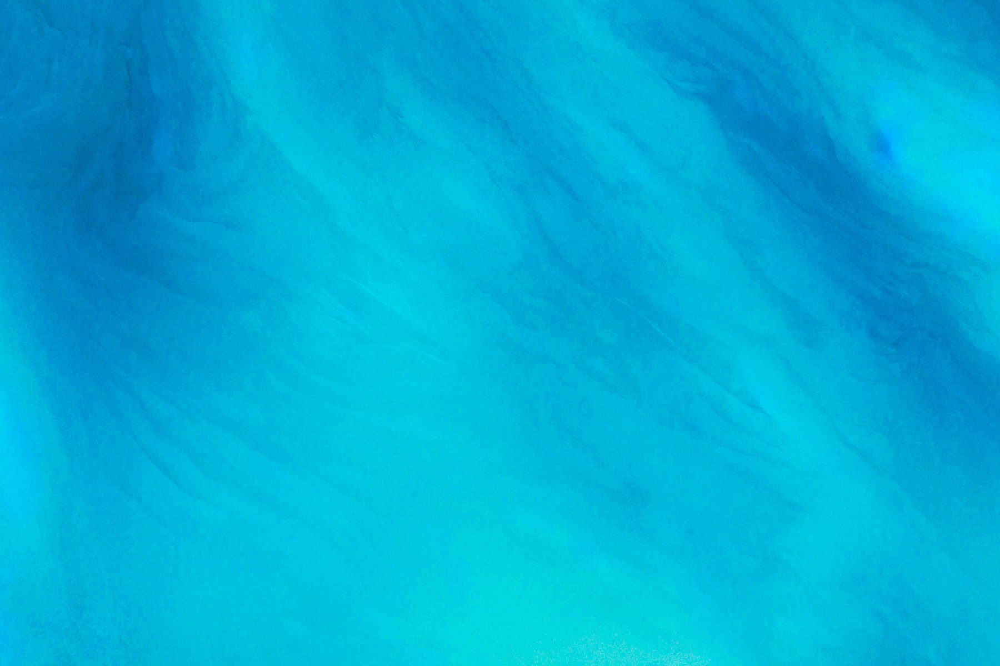

## Earth Catcher 

Simple CLI to download images from [Google Earth View](https://chrome.google.com/webstore/detail/earth-view-from-google-ea/bhloflhklmhfpedakmangadcdofhnnoh?hl=en).

### Installation

```
$ go get github.com/s3ththompson/earth-catcher
```

### Usage

```
earth [options...] EARTH_VIEW_URL
Options:
	-o name of output file
```

### Example

```
$ earth https://g.co/ev/2260
Northern Territory, Australia – Earth View from Google
Lat: -11.992309, Lng: 131.807527, ©2014 CNES / Astrium, Cnes/Spot Image, DigitalGlobe, Landsat, Sinclair Knight Merz, Sinclair Knight Merz & Fugro
Downloaded https://www.gstatic.com/prettyearth/assets/full/2260.jpg to northern-territory-australia-2260.jpg (1 file, 261.3 kB)
```